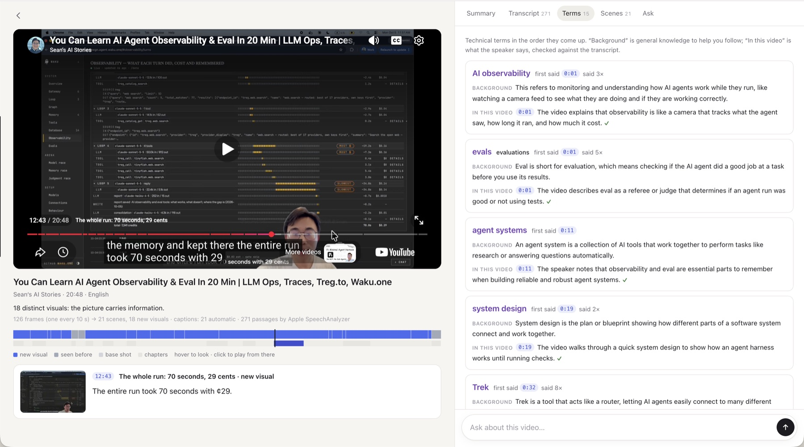

# Boson-Video

**Read any video like a document.** Paste a YouTube link or drop a video file. Every line of the
summary, the transcript and the screen text carries the second it came from, and questions are
answered from the video and checked against it.



- **The ribbon:** the whole video on one strip (scenes, chapters, most replayed). Hover to see any second's frame and words.
- **Summary:** sections with their frames; every sentence timed and checked (✓ ? ✗).
- **Transcript:** the original with English beneath, technical terms explained, on-screen text read in.
- **Ask:** answers that cite their moments and show the frames, with background kept apart.
- **Your own AI:** the same document as an MCP plugin for Claude, Cursor, Codex and ChatGPT.

Built for long talks, lectures and finance videos in a language you half know (Chinese and English today).

## Run it

```bash
uv sync
uv run boson-video web          # http://127.0.0.1:8770; the first run prints your invite code
```

More codes: `uv run boson-video invite "a friend"` (also `--list`, `--revoke CODE`). Keys go in
`.env`: `INCEPTION_API_KEY` (Mercury writes the summary) and `TYPESAFE_API_KEY` (Jev checks it and
answers questions). Without keys you still get the scenes, the transcript and search.

## Tested videos

Measured, one run each unless a range is shown. Mac: M5 MacBook with Apple's transcriber. Windows: a 12-thread laptop with
SenseVoice or Parakeet on the CPU. Full tables: [docs/measured.md](docs/measured.md).

| Video | Length | Scene map | Words | Transcript errors¹ | Screen text | Summary ✓ |
| --- | --- | --- | --- | --- | --- | --- |
| Money or Life 美股频道, Meta and AI (zh, talking head) | 24:53 | 1.3 s | 13.8 s (Mac) | no human captions | — | 13 / 13 |
| Money or Life 美股频道, AI drug discovery (zh, slides) | 28:24 | 1.1 s | 18.5 s (Mac) | not scored | 36 moments read | 15 / 16 |
| 程序员老王, LLM abliteration (zh, animated diagrams) | 11:35 | — | 10.0 s (Windows) | not scored | 88 moments; subtitles apart at 85 | 21–22 / 22–23 (several runs) |
| 陳永儀, TEDxTaipei (zh, talk) | 14:29 | — | 7.1 s (Mac) | 5.3% chars (Mac), 4.8% (SenseVoice) | — | 14 / 14 |
| Ken Robinson, TED (en, talk) | 20:06 | — | 9.9 s (Mac) | 10.0% words (Mac), 10.5% (Parakeet) | — | 22 / 25 |
| Sean's AI Stories, agent observability (en, screen recording) | 20:48 | 1.5 s | 13.2 s (Mac) | not scored | none: YouTube refused full resolution | 23 / 26 |
| Andrej Karpathy, Intro to LLMs (en, slides) | 59:48 | 1.6 s | 30.5 s (Mac) | only automatic captions | 19 of 20 slides right | 22 / 23 |
| Rick Astley, Never Gonna Give You Up (fast cuts) | 3:33 | 0.7 s | — | — | — | — |

¹ Against human captions (`scripts/accuracy.py`); about half the English errors are filler words the captions leave out.
Summary ✓: sentences confirmed against what was said (Jev and code).

## On a server

The `Dockerfile` runs the site in uploads-only mode (YouTube downloads stay on the user's side).
In Coolify: a new resource from this repo, build pack **Dockerfile**, port **8770**, your domain, a
volume at **`/data`**, and the two keys as environment variables. The first start downloads the
speech models (about 650 MB) and prints your invite code in the logs.

## In your own AI

```bash
claude mcp add boson-video -- uv --directory /path/to/Boson-Video run boson-video mcp
```

Your AI can open a video, read it, look at frames at full resolution, search and check claims. It
works with no keys. Cursor, Claude Desktop and web apps: [docs/plugin.md](docs/plugin.md).

## Command line

```bash
uv run boson-video <link | id | file>        # build a video: scenes, words, screen text, summary
uv run boson-video ask <video> "question"    # the moment that answers it
uv run boson-video serve                     # the local paste-a-link website
uv run pytest                                # tests (offline); -m live hits YouTube
```

## More

- [docs/DIRECTION.md](docs/DIRECTION.md): what we're building, milestones, decisions
- [docs/how-it-works.md](docs/how-it-works.md): the pipeline, what YouTube allows, limits
- [docs/measured.md](docs/measured.md): speed and accuracy, as measured
- [docs/timeline-format.md](docs/timeline-format.md): the document format, for other tools
- [AGENTS.md](AGENTS.md): the guide for coding agents

A personal research prototype. YouTube's terms don't allow automated access for products, which is
why shared use of YouTube links waits for the browser extension.
