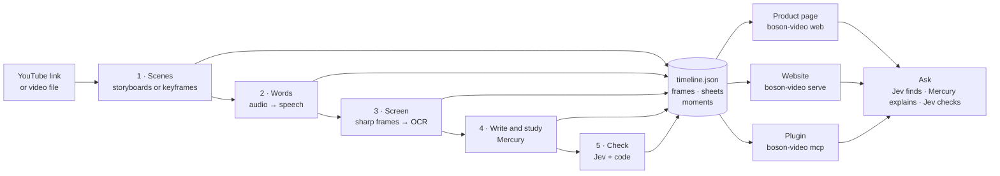

# The workflow

Boson-Video is a workflow, not an agent. A video goes through a fixed series of stages, each one
adding to a single document, `timeline.json`. The product page, the website and the plugin all
read that document. Only the first stage is required. When a later stage can't run (no key,
YouTube refuses, no OCR), the document goes on without it and says why.

Two stages use optional models: a **writer** (Mercury, from Inception, by default, or any
OpenAI-compatible model) and a **checker** (Jev, from TypeSafe). Without their keys those stages
are skipped, and the page says so.

## The stages

| # | Stage | What goes in → what comes out | Done by | Time (measured) | When it can't run |
| --- | --- | --- | --- | --- | --- |
| 1 | **Scenes** | The watch page and YouTube's storyboard sheets (or ffmpeg keyframes from a file) → frames, scenes marked new, repeat or base, chapters, the most-replayed curve | Code (`scenes.py`), no model | 0.7–1.6 s | The only stage that must work |
| 2 | **Words** | The audio (yt-dlp, 16 kHz, cut at pauses into up to 8 pieces) → passages, each with its start and end | Apple's transcriber on a Mac; SenseVoice (Chinese) or Parakeet (English) elsewhere | 7–31 s for 15–60 min on the Mac; 10–77 s on a 12-thread laptop | The page keeps its scenes and says there are no words |
| 3 | **Screen** | Full-resolution frames at every new visual and build step (one second each, read from the stream by ffmpeg) → the text on screen; burned-in subtitles kept apart; a build step keeps only the lines it adds | RapidOCR, in its own process | 15–90 s | Thumbnails instead, and the reason is printed (for example, YouTube answered 403) |
| — | **Moments** | Scenes, words and screen text → moments: one span coded *state*, *delta*, *trajectory* or *seek*, with its words, its new lines and its frame | Code (`moments.py`), rebuilt on every save | Instant | Not needed: built from whatever is there |
| 4 | **Write and study** | The transcript, the chapters, and names from the title, the description and the screen → a summary whose every sentence cites its passages; English for every passage; a glossary and starter questions (all three at once) | The writer (Mercury by default), strict JSON, one retry | 5–40 s | No writing key: no summary, and the page says so |
| 5 | **Check** | Each summary sentence against the passages it cites and their neighbours → ✓, ? or ✗, with the checker named. Numbers are compared by value in code; each question is asked in both option orders | The checker (Jev), plus code | About 1 s | No Jev key: numbers only, labelled "code" |
| Ask | **On demand** | A question → the passages that answer it, a plain explanation citing them, each sentence checked, anything the video doesn't say marked as background, the frames attached | Jev finds, Mercury explains, Jev checks | 2–6 s | No keys: search still works |

All times come from [measured.md](measured.md). They depend on the video, the machine and the
connection.

## The document

`timeline.json` is the contract between stages and for other tools. It is versioned, and its spec
is in [timeline-format.md](timeline-format.md). Each video has one folder in `BOSON_VIDEO_HOME`
(default `~/.boson-video`, or `/data` in the container):

| File | Holds |
| --- | --- |
| `timeline.json` | Everything above, except images |
| `sheets/` | The thumbnail sheets, so any frame can be cut without fetching again |
| `frames/` | Full-resolution frames, plus thumbnails cut on demand |
| `index.html` | The self-contained read view (`boson-video serve`, and opening as a file) |
| `status.json` | How far a background build has got |
| `notes.json` | Questions asked and their answers |

Each stage reads the document and writes it back. Stages share nothing else.

## Running a build

- **One background thread per video** (`jobs.py`). Progress goes to `status.json`: queued →
  scenes → words → screens → summary → done (or error, with the stage and the reason). It
  includes an estimate of when the words will be ready. The plugin and both pages read the same
  file, so a video opened in one is ready in the others.
- **No repeated work.** A finished video isn't rebuilt. A video missing a stage this machine can
  now do, such as a summary once a key exists, gets just that stage.
- **Parallel inside stages, in order between them.** Each stage needs the one before it. Inside
  each: sheets arrive in parallel over one HTTP/2 connection, audio pieces are transcribed at
  once, OCR reads frames while the rest are still downloading, and the summary, the English and
  the glossary are written together.

## The ways in

| Way in | For | What it adds |
| --- | --- | --- |
| `boson-video web` | Invited people (and the server) | Invite codes, each code's own videos and daily limits, uploads, the new page (tabs, three languages, frame preview). `--hosted` refuses YouTube links |
| `boson-video serve` | You, on your computer | A paste-a-link front page and the self-contained read view |
| `boson-video mcp` | Any AI or agent | Tools for a briefing on open, read, frames, search, check and list. Needs no keys. Runs over stdio or HTTP |
| `boson-video <video>` | The command line | Runs every stage and prints each one's time |

`web` and `serve` were built in parallel and do the same job; which one stays is still
open ([DIRECTION.md](DIRECTION.md)).

## Design rules

- **The steps are known in advance,** so code orders them and runs what it can in parallel.
  Loops stay small and bounded. The agent is the user's own AI, reading through the plugin.
- **It works without keys.** Writing and checking are extras, and each says what produced it.
- **Every model sits behind a small interface** (the three transcribers, Mercury, Jev), so any
  one can be swapped.
- **No sentence without its second.** A ✓ means "matches what was said or shown", not "true",
  and the reader sees which checker gave it.
- **Cost follows the pictures and the words, not the runtime.** Sharp frames and OCR happen only
  where something new appears, so an hour-long talk with 70 slides costs 70 frames.
- **YouTube downloads stay on the user's side.** A server takes uploads; YouTube links on a
  server wait for the browser extension.
- **Fail loudly.** A stage that falls back says so, in the command line, on the page and in the
  plugin.
- **Speed is measured.** Every stage is timed (`Stopwatch` in `pipeline.py`), and the numbers go
  into [measured.md](measured.md).

## At scale

The stages stay the same; where they run changes. Each stage becomes a job on a queue that
workers take (CPU for scenes, frames and OCR; GPU for speech when volume justifies it). The
document and frames move to object storage, and invite codes, notes and usage move to a
database. Videos are cached by id, so a popular video is built once. The three ways in become
clients of one API, sharing accounts and limits.
